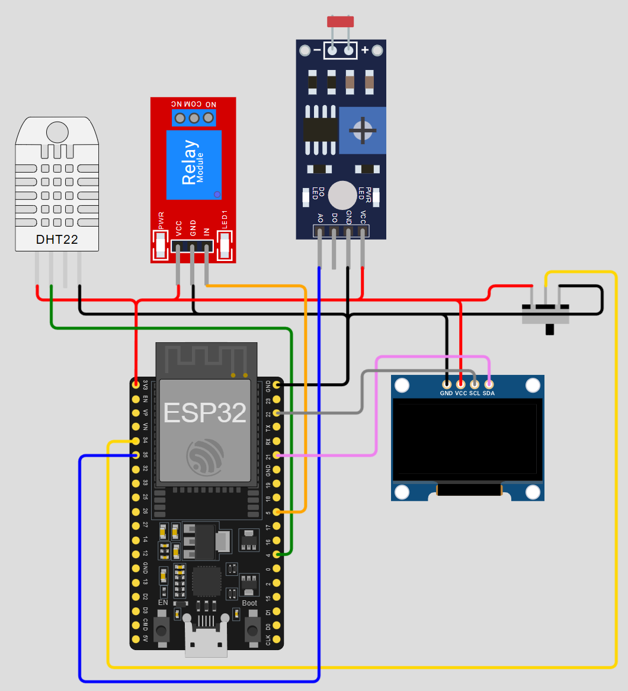

# ESP32 Smart Plant Care System 🌱

An intelligent, IoT-based solution for automated indoor gardening. This system monitors environmental conditions and manages irrigation automatically, ensuring your plants thrive even when you are away.

## 🌟 Features

- **Real-Time Monitoring:** continuously tracks soil moisture, ambient temperature, humidity, and light intensity.
- **Automated Irrigation:** Activates a water pump automatically when soil moisture drops below a calibrated threshold.
- **Wireless Connectivity:** Built on the ESP32 for reliable WiFi connectivity.
- **Remote Dashboard:** (Optional) Integrates with IoT platforms (Blynk/ThingsBoard) to visualize data and control the pump remotely.
- **Status Indicators:** LED or OLED display feedback for immediate system status.

## 🛠️ Hardware Requirements

| Component | Description | Where To Buy |
| :--- | :--- | :--- |
| **ESP32** | The main microcontroller with built-in WiFi/Bluetooth. | Bluetooth. |
| **Capacitive Moisture Sensor** | Measures soil water content (corrosion resistant). | Bluetooth. |
| **DHT11 / DHT22** | Digital sensor for measuring temperature and humidity. | Bluetooth. |
| **Relay Module (5V)** | Switches the high-current water pump on/off. | Bluetooth. |
| **Water Pump** | Mini submersible pump (3V-5V). | Bluetooth. |
| **LDR** | Light Dependent Resistor to monitor sunlight exposure. | Bluetooth. |
| **Power Supply** | 5V Micro USB or external battery pack. | Bluetooth. |

## 🔌 Circuit Diagram

*Note: Connect the components as follows:*

- **Moisture Sensor:** Analog Pin (e.g., GPIO 34)
- **DHT Sensor:** Digital Pin (e.g., GPIO 4)
- **Relay Module:** Digital Pin (e.g., GPIO 26)
- **LDR:** Analog Pin (e.g., GPIO 35)

## 💻 Software & Libraries

This project is developed using the **Arduino IDE**.

### Required Libraries:
1.  `DHT sensor library` by Adafruit
2.  `Adafruit Unified Sensor`
3.  `Blynk` (If using the mobile app integration)

## 🚀 Installation & Setup

1.  **Clone the Repository:**
    ```bash
    git clone https://github.com/your-username/ESP32-Smart-Plant-Care.git
    ```
2.  **Circuit Assembly:** Follow the pinout description to connect your sensors and pump to the ESP32.
3.  **Configure Credentials:** Open `SmartPlant.ino` and update your WiFi SSID, Password, and API tokens.
4.  **Upload Code:** Connect your ESP32 to the PC and upload the code via Arduino IDE.
5.  **Calibrate:** Test the moisture sensor in dry air vs. a cup of water to set your `wet` and `dry` threshold values in the code.

## 📊 Usage

Once powered on, the system will:
1.  Read sensor data every few seconds.
2.  Print the status to the Serial Monitor.
3.  Turn on the pump if `Moisture < Threshold`.
4.  Send data packets to the cloud dashboard.

## 📷 Gallery



## 🤝 Contributing

Contributions, issues, and feature requests are welcome!
Feel free to check the [issues page]([https://github.com/your-abderrahman-laid/ESP32-Smart-Plant-Care/issues](https://github.com/abderrahman-laid/ESP32-Smart-Plant-Care-System/issues)).

## 📝 License

This project is licensed under the MIT License - see the [LICENSE](LICENSE) file for details.

---
**Made with ❤️ by [Abderrahmane Laid](https://github.com/abderrahman-laid)**
